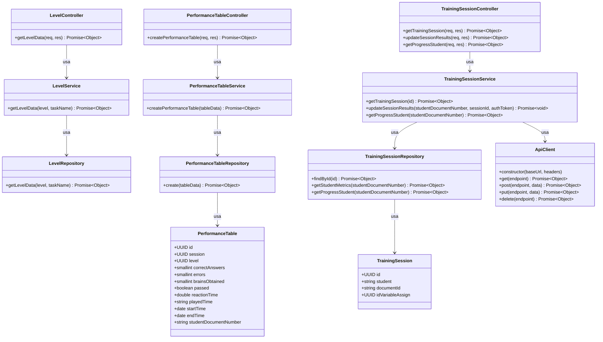

# Diagrama de Clases del Backend - Control Inhibitorio

Este documento presenta el diagrama de clases del backend del sistema de Control Inhibitorio, mostrando la estructura y relaciones entre las diferentes clases que componen la aplicación.

## Diagrama de Clases

## Descripción de Clases

### Modelos

#### PerformanceTable
Representa el registro de desempeño de un estudiante en un nivel específico durante una sesión de entrenamiento.

- **Atributos principales:**
  - `id`: Identificador único generado automáticamente (UUID)
  - `session`: Identificador de la sesión de entrenamiento
  - `level`: Referencia al nivel realizado
  - `correctAnswers`: Cantidad de respuestas correctas
  - `errors`: Cantidad de errores cometidos
  - `brainsObtained`: Cantidad de cerebros obtenidos como recompensa
  - `passed`: Indica si el estudiante aprobó el nivel
  - `reactionTime`: Tiempo promedio de reacción en segundos
  - `playedTime`: Tiempo total jugado en el nivel
  - `startTime`: Momento en que inició el nivel
  - `endTime`: Momento en que finalizó el nivel
  - `studentDocumentNumber`: Número de documento del estudiante

#### TrainingSession
Representa una sesión de entrenamiento cognitivo para un estudiante.

- **Atributos principales:**
  - `id`: Identificador único de la sesión de entrenamiento
  - `student`: Nombre del estudiante
  - `documentId`: Número de documento del estudiante
  - `idVariableAssign`: Identificador de asignación de variable

### Repositorios

#### LevelRepository
Maneja las operaciones de acceso a datos relacionadas con los niveles.

- **Métodos principales:**
  - `getLevelData(level, taskName)`: Obtiene datos de un nivel específico basado en el número de nivel y nombre de tarea

#### PerformanceTableRepository
Maneja las operaciones de acceso a datos relacionadas con las tablas de desempeño.

- **Métodos principales:**
  - `create(tableData)`: Crea un nuevo registro de desempeño en la base de datos

#### TrainingSessionRepository
Maneja las operaciones de acceso a datos relacionadas con las sesiones de entrenamiento.

- **Métodos principales:**
  - `findById(id)`: Busca una sesión de entrenamiento por su ID
  - `getStudentMetrics(studentDocumentNumber)`: Obtiene métricas de desempeño de un estudiante
  - `getProgressStudent(studentDocumentNumber)`: Obtiene el progreso de un estudiante en el entrenamiento

### Servicios

#### LevelService
Contiene la lógica de negocio relacionada con los niveles.

- **Métodos principales:**
  - `getLevelData(level, taskName)`: Valida parámetros y obtiene datos de un nivel específico

#### PerformanceTableService
Contiene la lógica de negocio relacionada con las tablas de desempeño.

- **Métodos principales:**
  - `createPerformanceTable(tableData)`: Valida datos y crea un nuevo registro de desempeño

#### TrainingSessionService
Contiene la lógica de negocio relacionada con las sesiones de entrenamiento.

- **Métodos principales:**
  - `getTrainingSession(id)`: Obtiene una sesión de entrenamiento por su ID
  - `updateSessionResults(studentDocumentNumber, sessionId, authToken)`: Actualiza los resultados de una sesión de entrenamiento
  - `getProgressStudent(studentDocumentNumber)`: Obtiene el progreso de un estudiante

### Controladores

#### LevelController
Maneja las solicitudes HTTP relacionadas con los niveles.

- **Métodos principales:**
  - `getLevelData(req, res)`: Procesa solicitudes para obtener datos de un nivel

#### PerformanceTableController
Maneja las solicitudes HTTP relacionadas con las tablas de desempeño.

- **Métodos principales:**
  - `createPerformanceTable(req, res)`: Procesa solicitudes para crear un nuevo registro de desempeño

#### TrainingSessionController
Maneja las solicitudes HTTP relacionadas con las sesiones de entrenamiento.

- **Métodos principales:**
  - `getTrainingSession(req, res)`: Procesa solicitudes para obtener una sesión de entrenamiento
  - `updateSessionResults(req, res)`: Procesa solicitudes para actualizar resultados de una sesión
  - `getProgressStudent(req, res)`: Procesa solicitudes para obtener el progreso de un estudiante

### Clientes

#### ApiClient
Cliente para comunicarse con APIs externas.

- **Métodos principales:**
  - `get(endpoint)`: Realiza solicitudes GET a la API
  - `post(endpoint, data)`: Realiza solicitudes POST a la API
  - `put(endpoint, data)`: Realiza solicitudes PUT a la API
  - `delete(endpoint)`: Realiza solicitudes DELETE a la API

## Patrones de Diseño

El backend sigue una arquitectura en capas con los siguientes componentes:

1. **Capa de Controladores**: Maneja las solicitudes HTTP y delega el procesamiento a los servicios.
2. **Capa de Servicios**: Contiene la lógica de negocio y coordina las operaciones entre repositorios y clientes externos.
3. **Capa de Repositorios**: Maneja el acceso a datos y las operaciones con la base de datos.
4. **Capa de Modelos**: Define la estructura de los datos y su mapeo a la base de datos.
5. **Capa de Clientes**: Proporciona interfaces para comunicarse con servicios externos.

Esta arquitectura sigue el patrón MVC (Modelo-Vista-Controlador) adaptado para aplicaciones backend, donde:
- Los Modelos representan los datos y su estructura
- Los Controladores manejan las solicitudes y respuestas HTTP
- Los Servicios y Repositorios implementan la lógica de negocio y acceso a datos

Además, se utiliza el patrón Singleton para las instancias de servicios, repositorios y controladores, asegurando que solo exista una instancia de cada clase en la aplicación.

[Volver](https://github.com/alejoDev117/Documentacion_Control_Inhibitorio/tree/main)