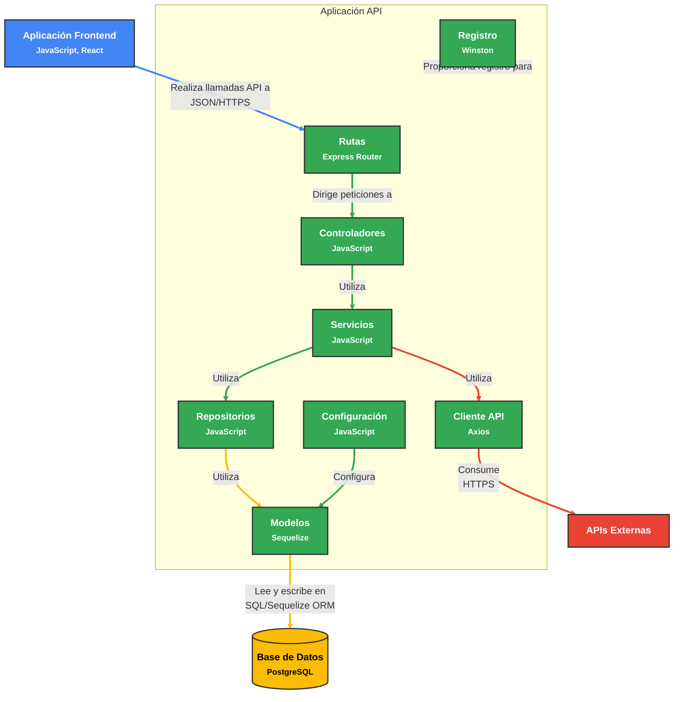

# Diagrama de Componentes C4 para el Backend de Control Inhibitorio

Este documento proporciona un diagrama detallado de componentes C4 para la aplicación Backend de Control Inhibitorio, ilustrando la arquitectura interna y las relaciones entre componentes.

## Diagrama de Componentes

## Descripción de Componentes

### Componente de Rutas
El componente de Rutas define los endpoints API para la aplicación. Utiliza Express Router para mapear peticiones HTTP a métodos específicos del controlador. Los principales archivos de rutas incluyen:
- **levelRoutes.js**: Define endpoints para gestionar niveles de juego
- **performanceTableRoutes.js**: Define endpoints para seguimiento y recuperación de métricas de rendimiento
- **trainingSessionRoutes.js**: Define endpoints para gestionar sesiones de entrenamiento

### Componente de Controladores
El componente de Controladores maneja las peticiones y respuestas HTTP. Valida datos de entrada, llama a los métodos de servicio apropiados y formatea las respuestas. Los principales archivos de controladores incluyen:
- **levelController.js**: Maneja peticiones relacionadas con niveles de juego
- **performanceTableController.js**: Maneja peticiones relacionadas con métricas de rendimiento
- **trainingSessionController.js**: Maneja peticiones relacionadas con sesiones de entrenamiento

### Componente de Servicios
El componente de Servicios implementa la lógica de negocio de la aplicación. Procesa datos, aplica reglas de negocio y coordina entre controladores y repositorios. Los principales archivos de servicios incluyen:
- **levelService.js**: Implementa lógica de negocio para niveles de juego
- **performanceTableService.js**: Implementa lógica de negocio para métricas de rendimiento
- **trainingSessionService.js**: Implementa lógica de negocio para sesiones de entrenamiento

### Componente de Repositorios
El componente de Repositorios proporciona una capa de acceso a datos que abstrae las operaciones de base de datos. Utiliza modelos Sequelize para interactuar con la base de datos. Los principales archivos de repositorios incluyen:
- **levelRepository.js**: Proporciona acceso a datos para niveles de juego
- **performanceTableRepository.js**: Proporciona acceso a datos para métricas de rendimiento
- **trainingSessionRepository.js**: Proporciona acceso a datos para sesiones de entrenamiento

### Componente de Modelos
El componente de Modelos define las estructuras de datos y relaciones utilizando Sequelize ORM. Los principales archivos de modelos incluyen:
- **performanceTable.js**: Define la estructura para métricas de rendimiento
- **trainingSession.js**: Define la estructura para sesiones de entrenamiento

### Componente Cliente API
El componente Cliente API proporciona un cliente reutilizable para realizar llamadas a APIs externas. Utiliza Axios para peticiones HTTP e incluye manejo de errores y configuración de peticiones.
- **ApiClient.js**: Implementa un cliente API genérico para servicios externos

### Componente de Configuración
El componente de Configuración gestiona la configuración de la aplicación. Incluye configuración para varios aspectos de la aplicación:
- **apiConfig.js**: Configuración para endpoints API
- **database.js**: Configuración de conexión a base de datos
- **sequelize.js**: Configuración de Sequelize ORM
- **logger.js**: Configuración de registro

### Componente de Registro
El componente de Registro maneja el registro de la aplicación en todos los componentes. Utiliza Winston para registro estructurado y proporciona diferentes niveles de registro para varios tipos de eventos.
- **logger.js**: Implementa funcionalidad de registro

## Relaciones

1. La Aplicación Frontend realiza llamadas API al componente de Rutas.
2. El componente de Rutas dirige las peticiones a los Controladores apropiados.
3. Los Controladores utilizan Servicios para implementar la lógica de negocio.
4. Los Servicios utilizan Repositorios para acceder a los datos.
5. Los Repositorios utilizan Modelos para interactuar con la base de datos.
6. Los Modelos leen y escriben en la Base de Datos PostgreSQL.
7. Los Servicios pueden utilizar el Cliente API para interactuar con APIs externas.
8. El componente de Configuración configura los Modelos y otros componentes.
9. El componente de Registro proporciona capacidades de registro en toda la aplicación.

Esta arquitectura sigue un enfoque por capas que separa las responsabilidades y promueve la mantenibilidad y la capacidad de prueba.

[Volver](https://github.com/alejoDev117/Documentacion_Control_Inhibitorio/tree/main)