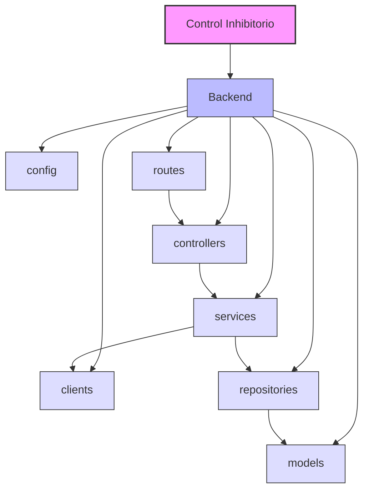

# Diagrama de Paquetes del Backend - Control Inhibitorio

Este documento presenta el diagrama de paquetes del backend del sistema de Control Inhibitorio, mostrando la estructura y relaciones entre los diferentes módulos que componen el backend de la aplicación.

## Diagrama de Paquetes del Backend

## Descripción de los Paquetes

### Backend

- **clients**: Contiene los clientes para comunicación con servicios externos.
- **config**: Configuraciones del sistema y variables de entorno.
- **controllers**: Controladores que manejan las peticiones HTTP y delegan la lógica de negocio a los servicios.
- **models**: Definiciones de las entidades del dominio y sus relaciones.
- **repositories**: Implementaciones para el acceso y manipulación de datos.
- **routes**: Definición de rutas y endpoints de la API.
- **services**: Implementación de la lógica de negocio.

## Relaciones entre Paquetes

- Los **controllers** utilizan los **services** para ejecutar la lógica de negocio.
- Los **services** utilizan los **repositories** para acceder a los datos.
- Los **repositories** trabajan con los **models** para manipular las entidades.
- Los **services** pueden utilizar **clients** para comunicarse con servicios externos.
- Las **routes** dirigen las peticiones a los **controllers** correspondientes.

[Volver](https://github.com/alejoDev117/Documentacion_Control_Inhibitorio/tree/main)