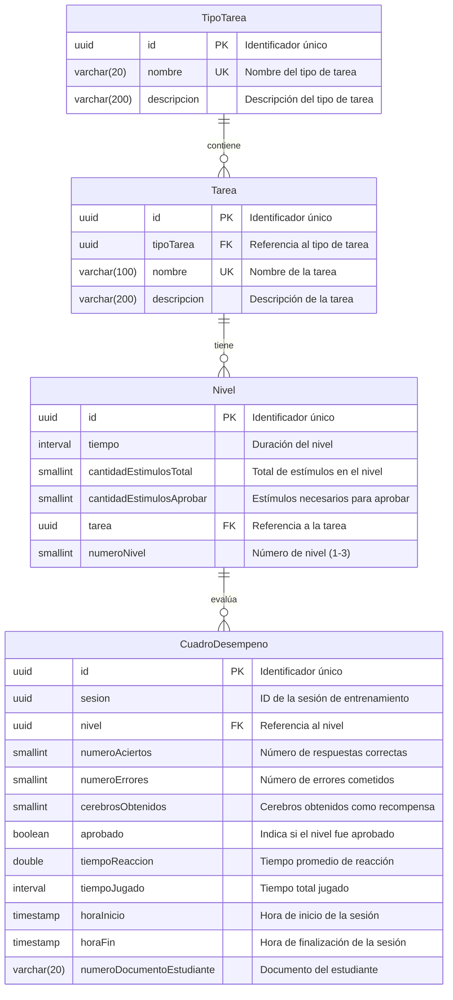

# Modelo Entidad-Relación - Control Inhibitorio

Este documento presenta el Modelo Entidad-Relación (MER) del sistema de Control Inhibitorio, basado en el esquema de base de datos definido en el archivo `ci.sql`.

## Diagrama Entidad-Relación

## Descripción de Entidades

### TipoTarea

Representa las categorías o tipos de tareas de control inhibitorio disponibles en el sistema.

- **Atributos principales:**
  - `id`: Identificador único generado automáticamente (UUID)
  - `nombre`: Nombre del tipo de tarea (debe ser único)
  - `descripcion`: Descripción detallada del tipo de tarea

- **Ejemplos de tipos de tarea:**
  - Go/NoGo: Responder rápidamente a ciertos estímulos y abstenerse ante otros
  - Stroop: Identificar el color de la tinta en palabras que representan colores
  - Simond Task: Emitir respuestas basadas en características específicas de los estímulos

### Tarea

Representa las tareas específicas de entrenamiento cognitivo disponibles en el sistema.

- **Atributos principales:**
  - `id`: Identificador único generado automáticamente (UUID)
  - `tipoTarea`: Referencia al tipo de tarea al que pertenece
  - `nombre`: Nombre único de la tarea
  - `descripcion`: Descripción detallada de la tarea

- **Ejemplos de tareas:**
  - Operación Navegante Solitario: Tarea tipo Stroop
  - Legado Cósmico: Tarea tipo Stroop
  - Náufragos Estelares: Tarea tipo Go/NoGo
  - Comunicación Interestelar: Tarea tipo Simond Task
  - Senda de los Antiguos: Tarea tipo Simond Task

### Nivel

Define los diferentes niveles de dificultad para cada tarea de entrenamiento.

- **Atributos principales:**
  - `id`: Identificador único generado automáticamente (UUID)
  - `tiempo`: Duración máxima permitida para completar el nivel
  - `cantidadEstimulosTotal`: Número total de estímulos presentados en el nivel
  - `cantidadEstimulosAprobar`: Número mínimo de estímulos correctos para aprobar
  - `tarea`: Referencia a la tarea a la que pertenece el nivel
  - `numeroNivel`: Número secuencial del nivel (1, 2 o 3)

- **Restricciones:**
  - La combinación de `tarea` y `numeroNivel` debe ser única
  - El número de nivel no puede ser mayor a 3
  - La cantidad de estímulos para aprobar no puede ser mayor que la cantidad total

### CuadroDesempeno

Registra el desempeño de un estudiante en un nivel específico durante una sesión de entrenamiento.

- **Atributos principales:**
  - `id`: Identificador único generado automáticamente (UUID)
  - `sesion`: Identificador de la sesión de entrenamiento
  - `nivel`: Referencia al nivel realizado
  - `numeroAciertos`: Cantidad de respuestas correctas
  - `numeroErrores`: Cantidad de errores cometidos
  - `cerebrosObtenidos`: Cantidad de cerebros obtenidos como recompensa
  - `aprobado`: Indica si el estudiante aprobó el nivel
  - `tiempoReaccion`: Tiempo promedio de reacción en segundos
  - `tiempoJugado`: Tiempo total jugado en el nivel
  - `horaInicio`: Momento en que inició el nivel
  - `horaFin`: Momento en que finalizó el nivel
  - `numeroDocumentoEstudiante`: Número de documento del estudiante

- **Restricciones:**
  - La hora de fin debe ser mayor o igual a la hora de inicio
  - El número de aciertos debe ser menor a 2000
  - El número de errores debe ser menor a 2000
  - El número de cerebros obtenidos debe ser menor a 1000

## Relaciones

1. **TipoTarea - Tarea**: Relación uno a muchos. Un tipo de tarea puede contener múltiples tareas específicas, pero cada tarea pertenece a un único tipo.

2. **Tarea - Nivel**: Relación uno a muchos. Una tarea puede tener múltiples niveles de dificultad, pero cada nivel pertenece a una única tarea.

3. **Nivel - CuadroDesempeno**: Relación uno a muchos. Un nivel puede tener múltiples registros de desempeño (uno por cada intento de estudiante), pero cada registro de desempeño está asociado a un único nivel.

## Funciones Principales

El esquema incluye dos funciones principales:

1. **obtenerresultadosestudianteft**: Obtiene los resultados de desempeño de un estudiante en formato JSON, incluyendo métricas por tarea, tipo de tarea, nivel, y otros indicadores de rendimiento.

2. **obtenerprogresoestudianteft**: Obtiene el progreso general de un estudiante, indicando qué niveles ha completado, si ha finalizado todo el entrenamiento, y el estado de aprobación de cada nivel.

[Volver](https://github.com/alejoDev117/Documentacion_Control_Inhibitorio/tree/main)