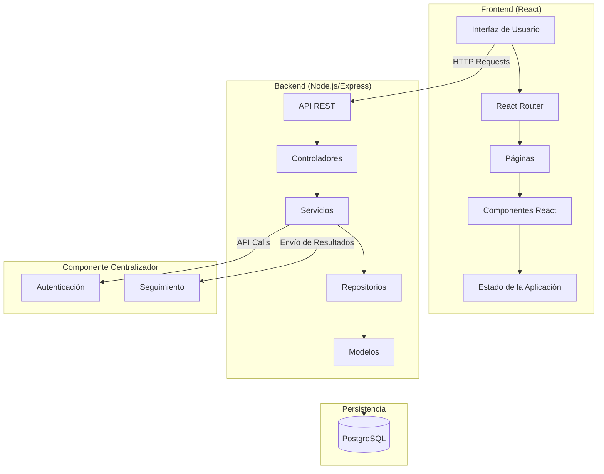
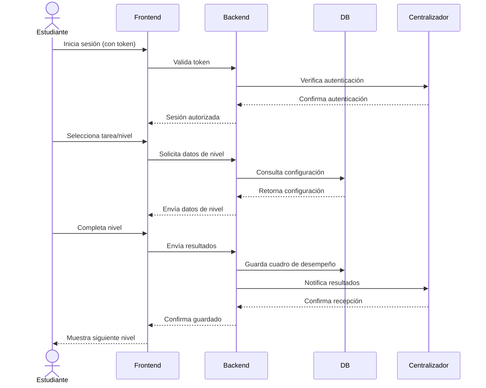
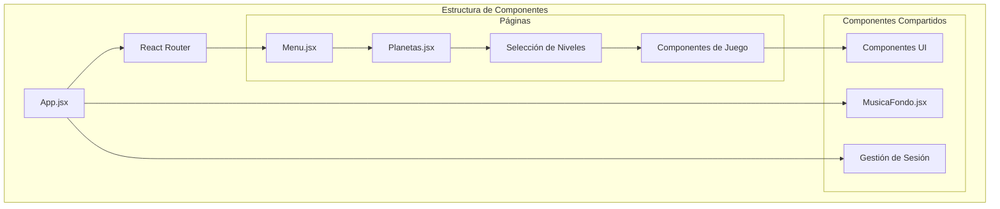
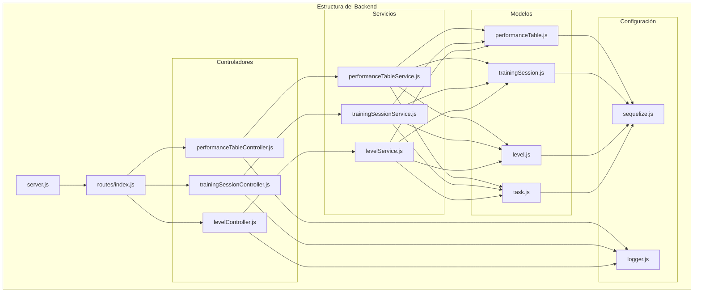
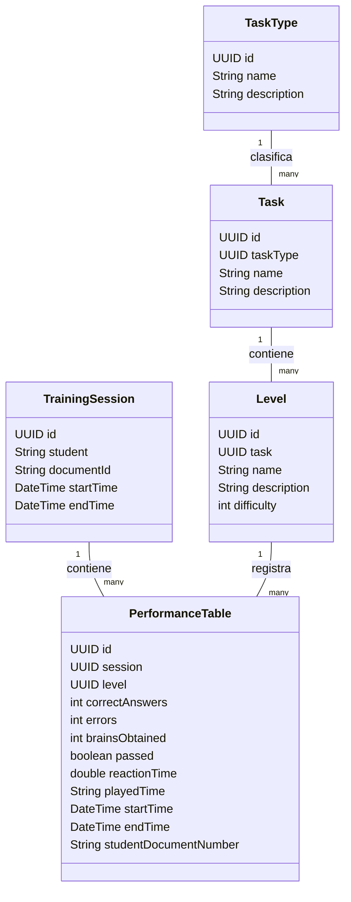

# Diseño Táctico de Alto Nivel - Cogniverse

## 1. Drivers Arquitectónicos

### 1.1 Requisitos de Calidad

#### Usabilidad
- **Interfaz Gamificada**: El sistema implementa una narrativa espacial (Cogniverse) con planetas y niveles para mejorar la experiencia de usuario y el compromiso de los estudiantes.
- **Continuidad de Sesiones**: Capacidad para pausar y continuar entrenamientos desde el punto exacto donde se dejaron.

#### Seguridad
- **Autenticación por Token**: Acceso protegido mediante tokens enviados por el componente centralizador.
- **Autorización por Roles**: Control de acceso basado en roles (Estudiante, Entrenador).

#### Disponibilidad
- **Funcionamiento Offline**: El sistema debe poder ejecutarse en un PC sin conexión a internet, de manera local.

#### Mantenibilidad
- **Código Modular**: Organización en componentes claramente separados tanto en frontend como en backend.
- **Logging Extensivo**: Registro de acciones, advertencias y errores en controladores y servicios.

### 1.2 Restricciones Tecnológicas

- **Frontend**: React con React Router para navegación entre componentes.
- **Backend**: Node.js con Express como framework web.
- **Base de Datos**: PostgreSQL con Sequelize como ORM.
- **API**: RESTful con métodos estándar (POST, GET, PUT) e intercambio de datos en formato JSON.
- **Documentación API**: Swagger para documentación interactiva.

### 1.3 Decisiones Clave

- **Arquitectura Cliente-Servidor**: Separación clara entre frontend (React) y backend (Node.js/Express).
- **Patrón MVC en Backend**: Organización en Modelos, Controladores y Servicios.
- **Componentes Reutilizables**: Estructura modular en frontend para reutilización de componentes.
- **Persistencia con ORM**: Uso de Sequelize para abstraer la interacción con la base de datos.
- **Integración con Componente Centralizador**: Comunicación con sistema externo para autenticación y seguimiento.

## 2. Diagramas de Arquitectura

### 2.1 Arquitectura General del Sistema

### 2.2 Flujo de Datos Principal

### 2.3 Arquitectura del Frontend

### 2.4 Arquitectura del Backend

### 2.5 Modelo de Dominio

## 3. Justificación de Diseño

### 3.1 Alineación con Drivers Arquitectónicos

#### Usabilidad
La arquitectura implementa una clara separación entre la lógica de presentación (frontend) y la lógica de negocio (backend), permitiendo una experiencia de usuario fluida y gamificada. La estructura de componentes en React facilita la creación de interfaces interactivas y la navegación entre diferentes "planetas" y "niveles" del juego.

#### Seguridad
El sistema implementa autenticación basada en tokens y autorización por roles, con validación en el backend. La comunicación con el componente centralizador para la autenticación asegura que solo usuarios autorizados puedan acceder al sistema.

#### Disponibilidad
La arquitectura permite el funcionamiento offline al tener una base de datos local y un servidor que puede ejecutarse en la misma máquina que el cliente. Esto satisface el requisito de poder ejecutar el sistema sin conexión a internet.

#### Mantenibilidad
La estructura modular tanto en frontend (componentes React) como en backend (controladores, servicios, repositorios) facilita el mantenimiento y la extensión del sistema. El uso de patrones como MVC en el backend y la separación de responsabilidades mejora la mantenibilidad del código.

### 3.2 Decisiones Tecnológicas

- **React + Node.js**: Esta combinación permite un desarrollo ágil y modular, con una clara separación entre frontend y backend.
- **PostgreSQL + Sequelize**: Proporciona una base de datos robusta con un ORM que facilita la interacción y mantiene la integridad de los datos.
- **Express**: Framework ligero que facilita la creación de APIs RESTful con rutas claras y middleware para funcionalidades como autenticación y logging.
- **Swagger**: Mejora la documentación y facilita la prueba de la API, lo que es crucial para el mantenimiento y la extensión del sistema.

### 3.3 Consideraciones de Escalabilidad

La arquitectura está diseñada para soportar múltiples usuarios y sesiones de entrenamiento simultáneas. La separación en capas (controladores, servicios, repositorios) permite escalar horizontalmente el backend si fuera necesario en el futuro. El frontend basado en componentes facilita la adición de nuevas funcionalidades sin afectar las existentes.

### 3.4 Integración con Componente Centralizador

La arquitectura contempla la comunicación con un componente centralizador externo para autenticación y seguimiento. Esta integración se realiza a través de servicios específicos en el backend, manteniendo la separación de responsabilidades y facilitando posibles cambios en la integración en el futuro.