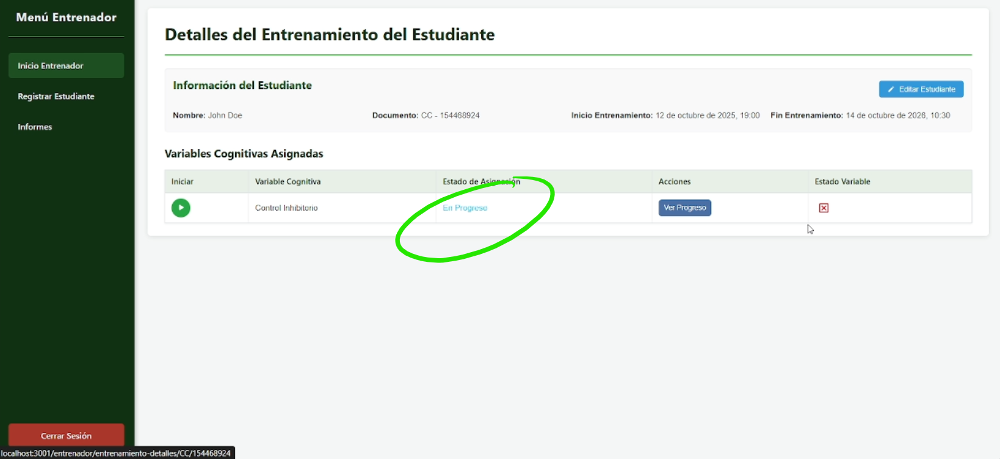
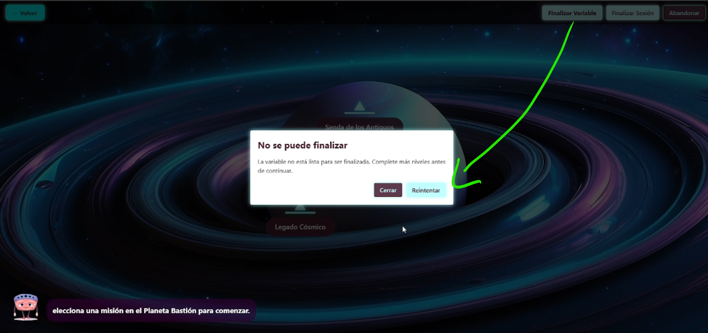

# Manual de Usuario: Módulo de Control Inhibitorio (Cogniverse)

## 1. Objetivo

Este manual proporciona una guía paso a paso para que los usuarios finales puedan navegar y utilizar de manera efectiva las tareas y funciones dentro del módulo de **Control Inhibitorio** en la plataforma Cogniverse.

---

## 2. Alcance

El alcance de este documento se limita exclusivamente a las funcionalidades del módulo de **Control Inhibitorio**. Se explica cómo iniciar la variable, navegar por sus menús, ejecutar las diferentes tareas de entrenamiento y finalizar la sesión o la variable por completo.

Este tutorial no cubre las funcionalidades del componente centralizador de Cogniverse, ya que se asume que estas se explican en un tutorial anterior.

---

## 3. Supuestos

* El usuario (estudiante) ya ha sido registrado en la plataforma Cogniverse por un entrenador.
* El usuario tiene acceso al componente centralizador desde donde se inician las variables de entrenamiento.

---

---

## 💡 Recomendaciones para una correcta ejecución

Si la pantalla de su dispositivo es demasiado pequeña , aleje el **zoom del navegador** hasta que todos los elementos del aplicativo se visualicen correctamente.

## 4. Navegación del Aplicativo

### 4.1. Inicio de la Variable

Para comenzar, el entrenador debe iniciar la variable de **Control Inhibitorio** desde el componente centralizador en el perfil del estudiante.

---

### 4.2. Menú de Bienvenida

Una vez iniciada la variable, serás recibido por la pantalla de inicio de Cogniverse.

1.  **Pantalla de Inicio:** Haz clic en cualquier lugar para continuar.

2.  **Avatar Cognicare:** El avatar, llamado **Cognicare**, te dará una serie de mensajes de bienvenida. Puedes hacer clic en la pantalla para avanzar por los mensajes o seleccionar **"Omitir Intro"** para ir directamente al menú principal.

3.  **Menú Principal:** Se presentarán tres opciones: **Iniciar**, **Opciones** y **Salir**. Actualmente, solo la opción **"Iniciar"** está habilitada. Las opciones "Opciones" y "Salir" quedarán disponibles en futuras versiones.

### 4.3. Menú de Planetas

Al dar clic en "Iniciar", accederás al menú de selección de planetas, que representa los conjuntos de tareas.

Desde aquí, tienes varias opciones:

* **Planeta Thallium:** Contiene el primer conjunto de tareas de entrenamiento.
* **Planeta Bastion:** Contiene el segundo conjunto de tareas.
* **Volver al menú inicial:** Te regresa a la pantalla de bienvenida con Cognicare.
* **Finalizar sesión:** Cierra la sesión actual, guardando el progreso para continuarlo más tarde. Regresarás al componente centralizador. Es la opción ideal si no has completado todo el entrenamiento y deseas seguir en otro momento.
* **Finalizar variable:** Termina por completo el entrenamiento para el módulo de Control Inhibitorio. Esta acción debe ser usada solo cuando el entrenador considera que el estudiante ha completado todas las tareas requeridas. Se mostrará un resumen de resultados antes de confirmar.

* **Abandonar:** Permite abandonar la sesión actual, pero con la oportunidad de volver a ingresar más tarde. Esta opción finaliza la interacción del momento, aunque la sesión queda abierta para próximas iteraciones. Es la opción ideal si la tarea aún no ha sido completada y se desea continuar en otro momento.

---

## 5. Planeta Thallium

Al ingresar al **Planeta Thallium**, encontrarás tres tareas principales de entrenamiento: Náufragos Estelares, Operación Navegante Solitario y Comunicación Estelar.

### 5.1. Tarea: Náufragos Estelares

En este juego, el objetivo es seleccionar las imágenes correctas (navegantes) e ignorar las incorrectas (monstruos) en un tiempo limitado.

* **Cómo Jugar:**
    1.  Al entrar, verás unas preguntas opcionales que puedes responder o saltar.
    
    

    2.  Selecciona uno de los **tres niveles** para comenzar. El juego avanzará automáticamente al siguiente nivel una vez que superes el actual.

    

    3.  Cuando aparezca un **navegante**, debes hacer clic en la imagen en menos de 3 segundos.

    

    4.  Cuando aparezca un **monstruo**, **no debes hacer clic** y esperar a que la imagen pase.

    

    5.  Cuando aparezca un **Pieza de la nave**, **no debes hacer clic** y esperar a que la imagen pase.

    

    6.  Puedes pausar y reanudar el juego en cualquier momento.
* **Resultados:** Al finalizar cada nivel, verás una pantalla con tus métricas: tiempo de reacción promedio, errores obtenidos, tiempo total y si fue **"Aprobado"** o **"No aprobado"**. Desde aquí, puedes elegir **"Jugar de nuevo"** o **"Enviar los resultados"** para guardar tu progreso.

    

### 5.2. Tarea: Comunicación Estelar

Esta tarea mide tu capacidad para seguir instrucciones espaciales rápidamente.

* **Cómo Jugar:**
    1.  La dinámica es similar a la tarea anterior; puedes responder preguntas opcionales y luego seleccionar uno de los tres niveles.
    2.  Las instrucciones te indicarán qué tecla presionar para mover una imagen hacia arriba o hacia abajo (por ejemplo, **'Q' para arriba y 'P' para abajo**).

    

    3.  Debes presionar la tecla correcta según la posición que se te indique para cada imagen.
    4.  El juego se puede pausar y reanudar. Al finalizar, puedes guardar tus métricas y volver al menú del planeta.

    

### 5.3. Tarea: Operación Navegante Solitario

Este juego se enfoca en la inhibición de la respuesta automática, pidiéndote que te concentres en el significado de una palabra en lugar de su color.

 

* **Cómo Jugar:**
    1.  La tarea consta de tres niveles que avanzan automáticamente al ser aprobados.
    2.  En la pantalla aparecerán palabras que nombran colores (ej. "amarillo", "rojo"), pero el texto de la palabra estará pintado de un color diferente.
    3.  Tu objetivo es hacer clic en el botón de color que **coincide con la palabra escrita**, no con el color de la tinta.
    4.  Dispones de las opciones para pausar o finalizar el nivel en cualquier momento.

    **Nota:** La dinámica del juego se vuelve más desafiante a medida que avanzas de nivel. Por ejemplo, en el nivel dos, si la palabra 'amarillo' aparece escrita en tinta de color azul, tu objetivo es seleccionar el ícono que corresponde al color de la tinta (azul), ignorando el significado de la palabra.

---

## 6. Planeta Bastion

El **Planeta Bastion** consta de dos tareas: Senda de los Antiguos y Legado Cósmico.

### 6.1. Tarea: Senda de los Antiguos

Esta tarea presenta una dinámica de juego similar a las anteriores, con tres niveles de dificultad y preguntas opcionales al inicio. Deberás seguir las indicaciones de la prueba, y esta finalizará si se alcanza un número determinado de errores.

**Nota**: El juego se asemeja a Comunicación Interestelar.

### 6.2. Tarea: Legado Cósmico

Este juego se distingue por tener **cuatro niveles**.

* **Cómo Jugar:**
    1.  Verás una ficha o recuadro con una palabra que nombra un color.
    2.  Tu tarea es seleccionar el color correcto de acuerdo a **la palabra que se indica en la ficha**.
    3.  Tienes las opciones de pausar, reiniciar o finalizar la prueba y enviar tus resultados.

    **Nota**: El juego se asemeja a Naufragante Solitario.

---

## 7. Finalización del Entrenamiento

Existen dos formas de concluir el uso del aplicativo, cada una con un propósito diferente.

### 7.1. Finalizar Sesión

Usa esta opción si el estudiante necesita detener el entrenamiento, pero **aún no ha completado todas las tareas** asignadas.

* Al hacer clic en **"Finalizar sesión"**, regresarás al componente centralizador.

* El estado de la variable aparecerá como **"En progreso"**.

* Para continuar más tarde, simplemente vuelve a iniciar la variable desde el perfil del estudiante. Podrás retomar las tareas pendientes o repetir alguna para mejorar el resultado.

### 7.2. Finalizar Variable

Esta opción se debe utilizar únicamente cuando el entrenador considera que **todo el entrenamiento del módulo ha concluido**.

1.  Desde el menú de planetas, haz clic en **"Finalizar variable"**.

2.  Aparecerá un mensaje de confirmación y un **resumen del estado** de todas las tareas y niveles (aprobado o pendiente).

3.  Si estás seguro, haz clic nuevamente en **"Finalizar variable"** para confirmar. Si crees que el estudiante aún debe completar algo, puedes dar clic en **"Cancelar"**.

4.  Al confirmar, serás devuelto al componente centralizador, donde podrás **ver el progreso y descargar el informe final de métricas**.

### 7.3. Solución de Problemas

Si al intentar finalizar la variable ocurre un error, la aplicación te dará la opción de **"Reintentar"**. Si el problema persiste, será necesario contactar al personal de soporte técnico.

